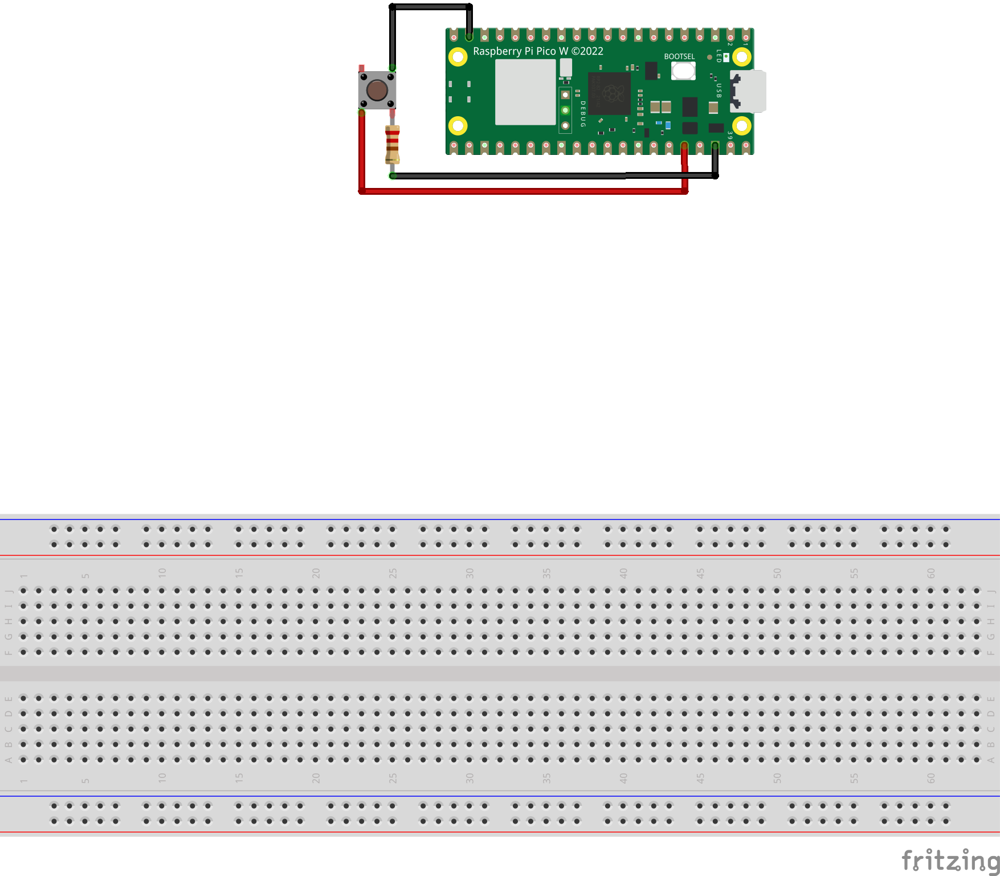

# Button

Two simple examples of how to use a button with a Pico and Node-RED.

1. button_sampling.py samples the state of the button every second

2. button_irc.py uses interrupts to detect when the button is pressed and released. Pin.IRC works by setting up an interrupt on the pin and calling a function when the interrupt is triggered. The function is called with the pin number and the state of the pin.

