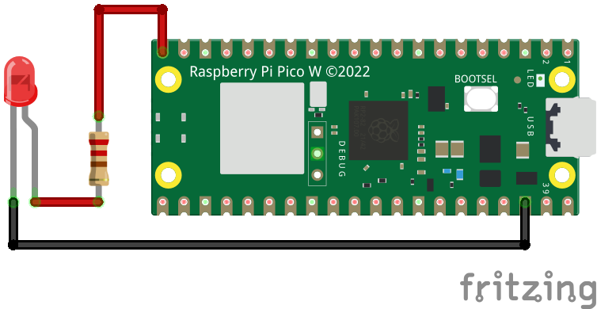
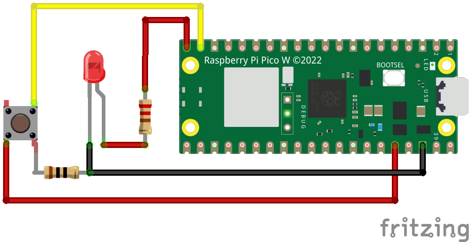

# Controlling an LED with a Raspberry Pi and Node-RED

## 1. Control an LED from the Node Red Dashboard

The led.py / flows.json example shows how to control an LED with a Raspberry Pi and Node-RED. The Raspberry Pi is running a simple Python script that listens for messages from Node-RED and turns the LED on or off.

## 2. Control an LED with a physical button and a button in the Node-RED Dashboard

The button_led.py / button_led_flow.json example uses both a dashboard button and a physical button to control the LED. This is an example of the Pico using publishing and subscribing to MQTT messages about the state of the button.

