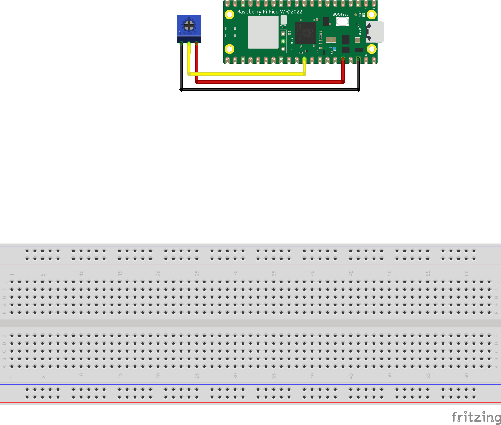

# Simple flow to control a potentiometer with a Pico and Node-RED

This flow will allow you to control a potentiometer with a Pico and Node-RED.

Node-Red simply outputs the value of the potentiometer in the debug window.

## Sketch

