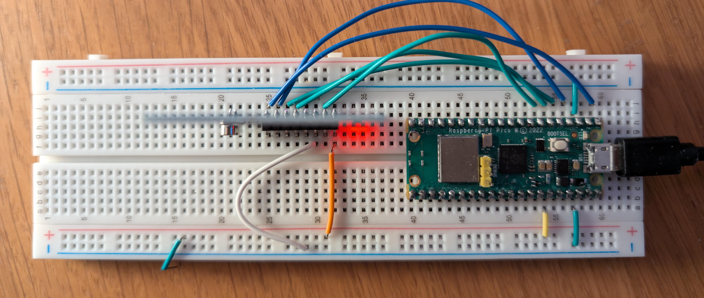

# RFID Example

This example shows how to use the RFID module with the Raspberry Pi Pico.

It uses the MFRC522 library to read the RFID card and display the card's UID on the serial monitor. On the Node-RED side, it simulates locking and unlocking a door based on the RFID card's UID.

### Picture of the Circuit

This is shown from above, with the RFID module on the left and the Raspberry Pi Pico on the right.

Left to right the pins are connected as follows:

- SDA
- SCK
- MOSI
- MISO
- IRQ
- GND
- RST
- 3.3V

