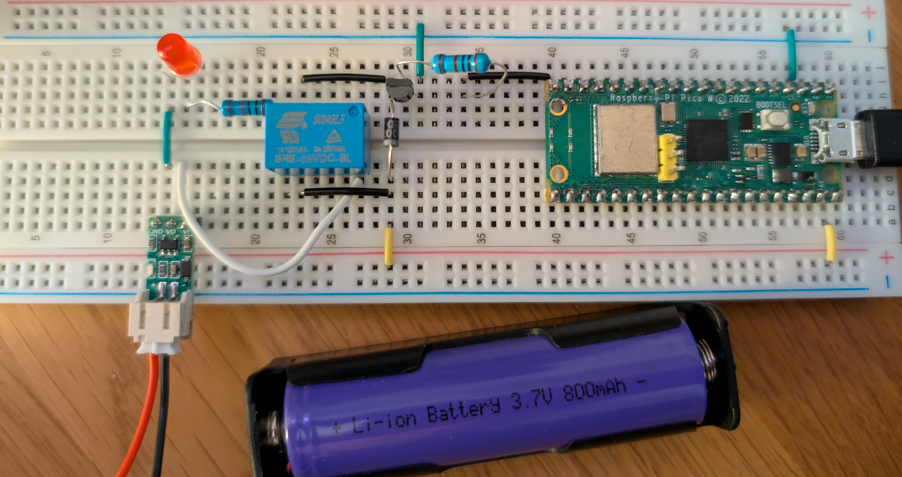

# Using a Relay to control an LED

This example demonstrates how to use a relay to control an LED with a Raspberry Pi Pico W. The relay is connected to the Pico W using a breadboard. The Pico W is running a simple Python script that listens for messages from Node-RED and turns a corresponding relay on and off in the Node-RED dashboard.

This is useful for potential situations where you want to control a high voltage device like a light bulb or a fan. The relay acts as a switch that can be controlled by the Pico W.

