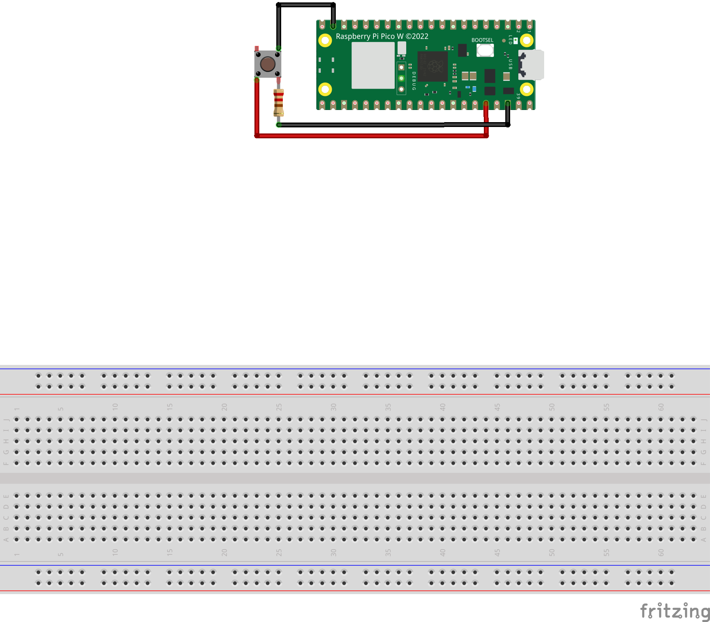

# Button

Two simple examples of how to use a button with a Pico and Node-RED.

1. Samples the state of the button every second

2. Uses interrupts to detect when the button is pressed (to follow)

